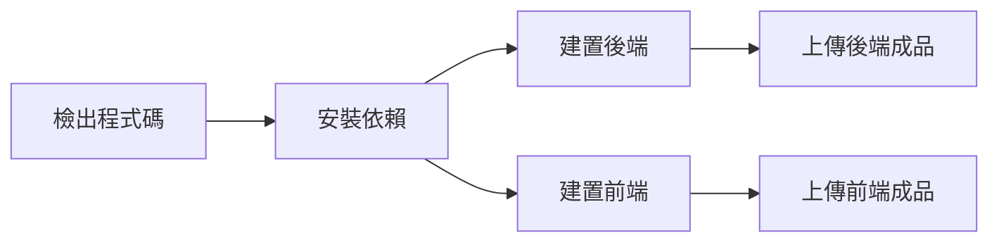

# 🚀 部署流程概覽

## 📋 概述

這個專案使用 GitHub Actions 自動化部署到 Zeabur，**不需要 Docker Hub**。部署流程包括建置、測試和直接部署到 Zeabur 平台。

## 🔄 部署流程

### 1. 觸發部署
- **手動觸發**: 透過 GitHub Actions 頁面手動執行
- **自動觸發**: 推送到特定分支時自動執行測試

### 2. 建置階段


### 3. 測試階段
- **後端測試**: 執行 Jest 單元測試
- **前端測試**: 執行 Jest 和 Cypress E2E 測試
- **可選跳過**: 使用強制部署選項跳過測試

### 4. 部署階段
- **下載成品**: 從 GitHub Actions 下載建置成品
- **準備檔案**: 整理部署所需的檔案
- **部署到 Zeabur**: 使用 Zeabur CLI 直接部署

## 🏗️ 建置方式

### 後端建置 (NestJS)
```bash
# 在 HealthRecord 目錄
yarn install --frozen-lockfile
yarn build
```
- 產出目錄: `HealthRecord/dist/`
- 環境變數: `NODE_ENV`

### 前端建置 (Next.js)
```bash
# 在 HealthRecord-FE 目錄
yarn install --frozen-lock-file
yarn build
```
- 產出目錄: `HealthRecord-FE/.next/`
- 環境變數: `NEXT_PUBLIC_API_URL`, `NEXT_PUBLIC_ENVIRONMENT`

## 📦 部署成品

### 後端成品
- 編譯後的 JavaScript 檔案
- 必要的配置檔案
- `package.json` 用於依賴管理

### 前端成品
- Next.js 靜態檔案
- 建置後的 React 應用
- 環境特定的配置

## 🌍 環境配置

### 開發環境 (dev)
- 分支: `develop`
- 用途: 功能開發和測試
- 配置: 開發環境變數

### 測試環境 (stg)
- 分支: `staging`
- 用途: 整合測試和驗證
- 配置: 測試環境變數

### 生產環境 (prod)
- 分支: `main`
- 用途: 對外服務
- 配置: 生產環境變數

## ⚙️ 必要設定

### GitHub Secrets
```bash
ZEABUR_TOKEN=your-zeabur-api-token
ZEABUR_PROJECT_ID=your-zeabur-project-id
NEXT_PUBLIC_API_URL=https://api.yourdomain.com
```

### Zeabur 專案設定
1. 在 Zeabur 建立新專案
2. 設定環境變數
3. 配置域名和 SSL
4. 設定自動擴展規則

## 🔍 部署狀態檢查

### GitHub Actions
- 查看工作流程執行狀態
- 檢查建置和測試結果
- 下載建置成品

### Zeabur 控制台
- 檢查應用運行狀態
- 查看日誌和錯誤
- 監控資源使用情況

## 🚨 故障排除

### 建置失敗
- 檢查依賴版本相容性
- 確認 Node.js 版本
- 檢查 TypeScript 編譯錯誤

### 測試失敗
- 檢查測試配置
- 確認環境變數設定
- 查看測試日誌

### 部署失敗
- 檢查 Zeabur Token 權限
- 確認專案 ID 正確性
- 查看 Zeabur 部署日誌

## 💡 最佳實踐

### 1. 分支管理
- 使用 GitFlow 工作流程
- 保護主要分支
- 定期清理功能分支

### 2. 測試策略
- 部署前執行完整測試
- 使用強制部署時謹慎
- 監控測試覆蓋率

### 3. 部署策略
- 先在測試環境驗證
- 使用藍綠部署或滾動更新
- 設定自動回滾機制

### 4. 監控和日誌
- 設定應用監控
- 收集錯誤日誌
- 監控效能指標

## 📚 相關資源

- [Zeabur 官方文件](https://docs.zeabur.com/)
- [GitHub Actions 文件](https://docs.github.com/en/actions)
- [NestJS 部署指南](https://docs.nestjs.com/deployment)
- [Next.js 部署指南](https://nextjs.org/docs/deployment)

---

**最後更新**: $(date)
**版本**: 1.0.0
