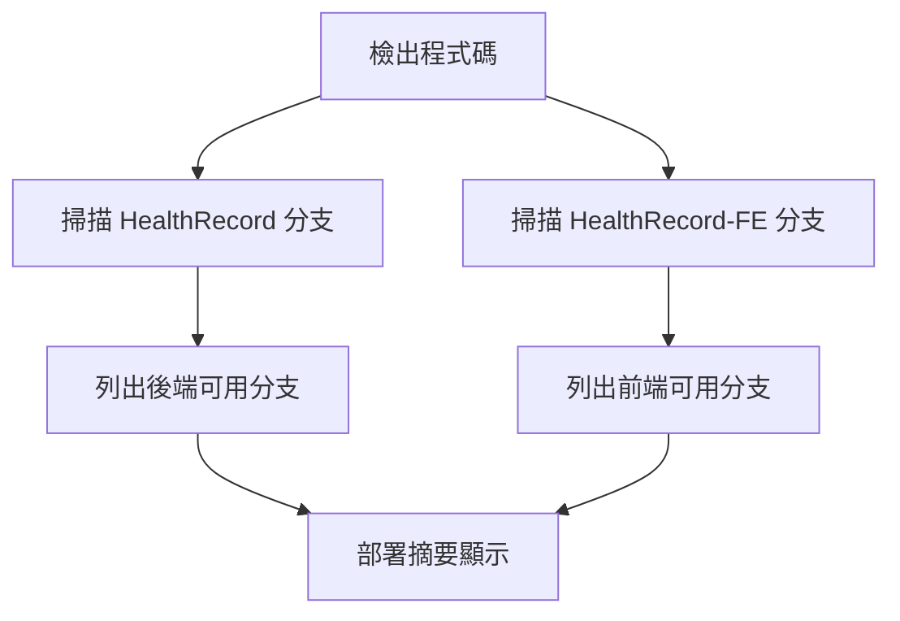

# 🔍 動態分支偵測功能

## 📋 概述

這個 GitFlow 工作流程現在支援**動態分支偵測**，不再需要預先定義固定的分支選項。系統會自動偵測您的前後端專案實際有哪些分支，讓部署更加靈活。

## 🚀 主要特點

### ✅ **自動偵測分支**
- 自動掃描 `HealthRecord` 專案的所有遠端分支
- 自動掃描 `HealthRecord-FE` 專案的所有遠端分支
- 無需手動維護分支列表

### ✅ **靈活輸入**
- 後端分支：自由輸入任何存在的分支名稱
- 前端分支：自由輸入任何存在的分支名稱
- 支援功能分支、熱修復分支等任何命名模式

### ✅ **即時驗證**
- 部署時會顯示所有可用分支
- 在部署摘要中顯示完整的分支列表
- 幫助您了解可用的部署選項

## 🔧 使用方法

### 1. **手動觸發部署**
在 GitHub Actions 頁面中：

```
🚀 Deploy to Zeabur

部署環境: [dev ▼] (dev/stg/prod)
後端專案分支 (HealthRecord): [輸入分支名稱]
前端專案分支 (HealthRecord-FE): [輸入分支名稱]
是否建置後端: [☑️] 
是否建置前端: [☑️]
強制部署（跳過測試）: [☐]

[Run workflow] [Cancel]
```

### 2. **分支名稱輸入**
- **後端分支**: 直接輸入分支名稱，如：
  - `develop`
  - `feature/user-auth`
  - `hotfix/security-patch`
  - `release/v1.2.0`

- **前端分支**: 直接輸入分支名稱，如：
  - `main`
  - `feature/nutrition-ui`
  - `hotfix/mobile-layout`
  - `staging`

## 📊 分支偵測流程

### 1. **自動掃描**


### 2. **分支發現**
- 掃描 `origin/*` 遠端分支
- 排除 `HEAD` 引用
- 按字母順序排序
- 顯示在部署日誌中

### 3. **即時顯示**
在部署摘要中會顯示：
```
## 📋 可用分支資訊

### 🏗️ 後端專案 (HealthRecord) 可用分支
```
develop
feature/health-tracking
feature/user-auth
hotfix/security-patch
main
staging
```

### 🎨 前端專案 (HealthRecord-FE) 可用分支
```
develop
feature/nutrition-ui
feature/workout-tracking
hotfix/mobile-layout
main
staging
```
```

## 💡 使用建議

### 🎯 **開發階段**
- 環境：`dev`
- 後端分支：`develop` 或 `feature/*`
- 前端分支：`develop` 或 `feature/*`

### 🔧 **測試階段**
- 環境：`stg`
- 後端分支：`staging` 或 `develop`
- 前端分支：`staging` 或 `develop`

### 🚀 **生產階段**
- 環境：`prod`
- 後端分支：`main` 或 `staging`
- 前端分支：`main` 或 `staging`

### ⚡ **緊急修復**
- 環境：`prod`
- 後端分支：`hotfix/*`
- 前端分支：`hotfix/*`

## 🔍 分支命名規範

### 推薦的分支命名模式
```
main                    # 主分支
develop                 # 開發分支
staging                 # 測試分支
feature/功能名稱        # 功能分支
hotfix/修復描述         # 熱修復分支
release/版本號          # 發布分支
```

### 實際範例
```
# 後端專案
feature/health-tracking
feature/user-authentication
hotfix/database-connection
release/v1.2.0

# 前端專案
feature/nutrition-ui
feature/workout-tracking
hotfix/mobile-responsive
release/v1.2.0
```

## 🚨 注意事項

### 1. **分支存在性**
- 輸入的分支必須在對應的專案中存在
- 如果分支不存在，部署會失敗
- 建議先檢查可用分支列表

### 2. **環境安全性**
- 生產環境建議使用穩定分支
- 功能分支可以部署到開發環境進行測試
- 熱修復分支需要謹慎使用

### 3. **分支同步**
- 確保前後端分支的相容性
- 建議使用對應的分支進行部署
- 避免版本不匹配的問題

## 🆘 故障排除

### 分支找不到
- 檢查分支名稱是否正確
- 確認分支已推送到遠端
- 查看部署日誌中的可用分支列表

### 部署失敗
- 檢查分支是否存在
- 確認分支名稱拼寫正確
- 查看驗證步驟的錯誤訊息

## 📚 相關資源

- [Git 分支管理最佳實踐](https://git-scm.com/book/zh-tw/v2/Git-%E5%88%86%E6%94%AF-%E5%88%86%E6%94%AF%E7%AE%A1%E7%90%86)
- [GitFlow 工作流程](https://nvie.com/posts/a-successful-git-branching-model/)
- [GitHub Actions 手動觸發](https://docs.github.com/en/actions/managing-workflow-runs/manually-running-a-workflow)

---

**最後更新**: $(date)
**版本**: 1.0.0
